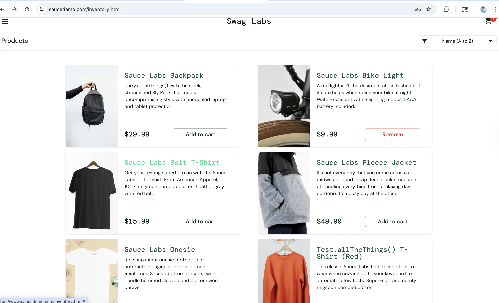
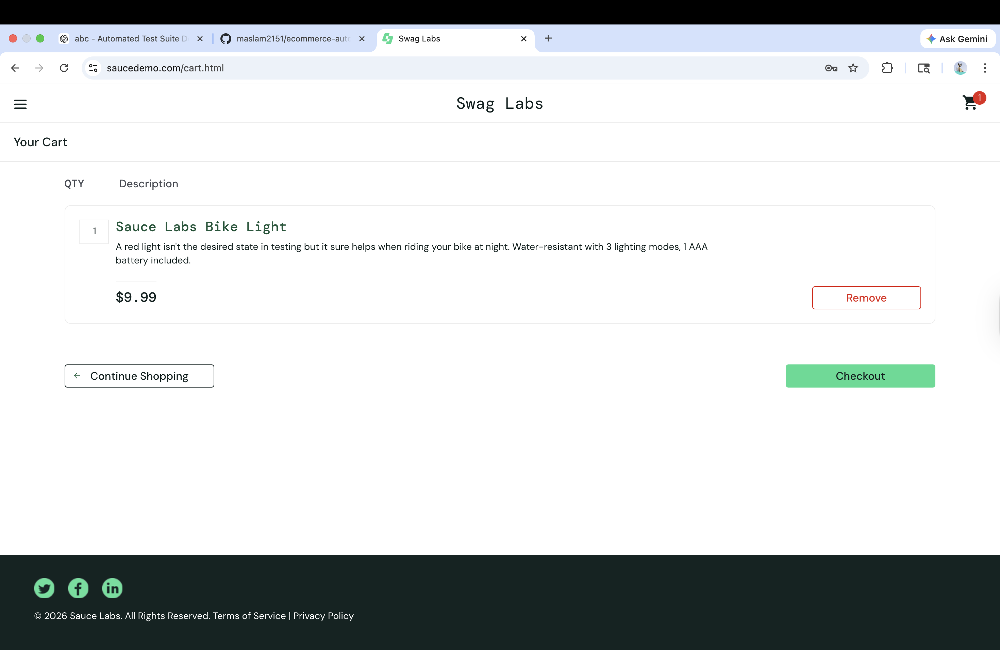

# E-commerce Automation Framework

Automated UI testing framework for an e-commerce application using **Java, Selenium WebDriver, and TestNG**.
The framework follows the **Page Object Model (POM)** design pattern and is structured for **scalability, maintainability, and CI/CD integration**.

---

# Table of Contents

* [Project Overview](#project-overview)
* [Tech Stack](#tech-stack)
* [Framework Architecture](#framework-architecture)
* [Project Structure](#project-structure)
* [Features](#features)
* [Test Scenarios](#test-scenarios)
* [Framework Execution](#framework-execution)
* [Test Reports](#test-reports)
* [Running the Tests](#running-the-tests)
* [Future Improvements](#future-improvements)
* [Author](#author)

---

# Project Overview

This project demonstrates a **Selenium automation framework** designed to test core workflows of an e-commerce web application.

The framework automates common user scenarios such as:

* User login
* Product selection
* Add product to cart
* Cart validation

The automation framework is built using the **Page Object Model (POM)** to ensure:

* Clean separation of test logic
* Reusable page components
* Easy maintenance and scalability

---

# Tech Stack

| Technology         | Purpose                            |
| ------------------ | ---------------------------------- |
| Java               | Programming language               |
| Selenium WebDriver | Browser automation                 |
| TestNG             | Test execution framework           |
| Maven              | Dependency management & build tool |
| Page Object Model  | Framework design pattern           |
| Git & GitHub       | Version control                    |

---

# Framework Architecture

The project follows the **Page Object Model (POM)** design pattern.

Each page of the application has its own **Page Class**, which contains:

* Element locators
* Page actions
* UI validations

Tests interact with these page objects instead of directly interacting with Selenium.

Benefits:

* Improves code readability
* Reduces duplication
* Makes test maintenance easier

---

# Project Structure

```
ecommerce-automation-framework
│
├── screenshots
│   ├── framework-run.png
│   ├── framework-cart.png
│
├── src
│   ├── main
│   │   └── java
│   │       └── com.ecommerce.pages
│   │           ├── LoginPage.java
│   │           └── InventoryPage.java
│   │
│   └── test
│       └── java
│           ├── com.ecommerce.tests
│           │   ├── LoginTest.java
│           │   └── AddToCartTest.java
│           │
│           ├── com.ecommerce.listeners
│           │   └── TestListener.java
│           │
│           └── com.ecommerce.utils
│               ├── DriverFactory.java
│               └── ScreenshotUtils.java
│
├── pom.xml
└── README.md
```

---

# Features

* Automated login workflow testing
* Product add-to-cart validation
* Page Object Model architecture
* Screenshot capture on test failure
* Maven-based project structure
* TestNG execution and reporting
* Clean modular framework design

---

# Test Scenarios

## Login Test

Validates that a user can successfully log into the application.

Steps:

1. Navigate to login page
2. Enter valid credentials
3. Submit login
4. Verify inventory page loads

---

## Add To Cart Test

Validates that a product can be added to the cart.

Steps:

1. Login to the application
2. Add product to cart
3. Open cart
4. Verify correct product is displayed

---

# Framework Execution

Example automation execution showing successful login and product selection.

### Inventory Validation




### Cart Page

Product successfully added to the cart.




---

# Test Reports

After executing tests using Maven, reports are generated in:

```
target/surefire-reports/
```

Open:

```
index.html
```

to view the TestNG report in your browser.

The report includes:

* Test execution results
* Passed/Failed tests
* Execution time
* Detailed test logs

---

# Running the Tests

Run all tests using Maven:

```
mvn test
```

This will:

1. Launch the browser
2. Execute all TestNG tests
3. Generate execution reports

---

# Future Improvements

Possible enhancements for the framework:

* Parallel test execution
* Jenkins CI/CD integration
* Selenium Grid for cross-browser testing
* Allure reporting integration
* Dockerized test execution

---

# Author

Mohammed Aslam
Java Backend / QA Automation Engineer

GitHub:
https://github.com/maslam2151
